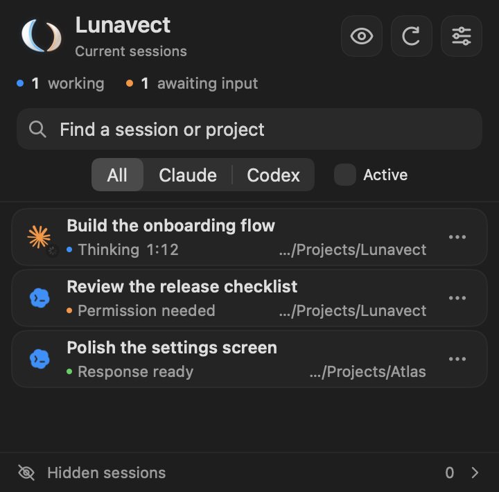

# Lunavect

**Claude Code and Codex, together in your Mac menu bar.**

See which sessions are working, which need your attention, and how much of your usage allowance remains. Connect either client or both — the app adapts to your setup.

[Download for macOS](https://github.com/lovach/Lunavect/releases/latest) · [Report a problem](https://github.com/lovach/Lunavect/issues) · [Source license](LICENSE)



## What it does

- **Live session overview:** working, waiting for input or permission, and completed sessions in one panel. Open the original session, reorder cards, or hide them from Lunavect.
- **Usage limits:** remaining weekly and five-hour allowances where the official client provides them, reset times, and an optional Claude model-specific allowance.
- **Desktop widgets:** limits, activity, and overview widgets. WidgetKit controls when the desktop refreshes.
- **Local activity statistics:** time observed working, with project and session breakdowns. Missing observations are not counted as work.
- **Optional notifications:** sounds and banners are off until you enable them.
- **Animated menu-bar companions:** Claude, Codex, or Lunavect; automatic selection can follow the busier client.
- **Six interface languages:** English, Russian, German, Spanish, French, and Simplified Chinese.
- **Signed updates from GitHub:** new versions are visible in the app and can download automatically.


## Install

Requires **macOS 14 or later**. The release includes Apple silicon and Intel code. The current release has been exercised on an Apple silicon Mac; other machines still need community testing.

1. Download the DMG from [Releases](https://github.com/lovach/Lunavect/releases/latest).
2. Drag **Lunavect** to **Applications** and open it there.
3. Choose **Connect Claude** or **Connect Codex**. The guide helps you locate or install the official client, then sends sign-in to that client.

You only need the service you choose. Claude usage requires the official **Claude Code CLI**; Claude Desktop by itself is not enough. Codex usage comes from the official local Codex client. Supported allowances depend on what that client exposes for your account. An absent value means unavailable data, not an unlimited plan.

To add a widget, right-click the desktop → **Edit Widgets** → search **Lunavect**. No Accessibility permission is needed for this step.

## Your data stays on your Mac

Lunavect has no account system or analytics backend. It does not ask for your provider password or API key. Authentication stays in the official Claude/Codex client.

The app reads local usage and session information, and installs its own local event handlers with your setup choices. Session names, project paths, and activity records are stored locally. GitHub receives normal update requests; your session information is not included. The official clients and their installers make their own network requests.

See [connection details and removal](docs/connections.md) and [activity data](docs/activity.md). Before deleting the app, disconnect its event handlers in Settings → Connections so your previous Claude status line can be restored.

## A few things to know

- This is an early release. A successful build does not prove compatibility with every subscription, client version, Mac, or macOS release. See [validation and open limits](docs/verification.md).
- Live session state depends on the official client delivering events. If data goes stale, check Connections and follow its repair guidance.
- Desktop widgets refresh on the system's schedule. The optional experimental transparent background is **off by default** and may stop working after macOS updates.
- The optional closed-lid keep-awake mode is experimental; it does not guarantee that every Mac will keep running with its lid closed.
- Lunavect is independent of Anthropic and OpenAI. Their marks and mascots remain their property; see [NOTICE](NOTICE).

## Build from source

Use Xcode with a Swift toolchain supporting the project. From the repository root:

```sh
./scripts/check.sh
```

This runs tests and builds a universal Release app and WidgetKit extension without a signing account. For signed development builds, copy `Config/Local.xcconfig.example` to `Config/Local.xcconfig`, set your own team, and run `./scripts/build.sh`. Generated products live outside the project. The icon and animation resources are already included; Node.js is only needed to re-export the icon.

`Sources/Weekleft` contains the macOS interface, `Sources/WeekleftCore` the local integrations and data model, and `Widget` the WidgetKit extension. Compatibility-facing targets and bundle identifiers remain named Weekleft.

[Development guide](docs/development.md) · [Release checklist](RELEASE.md) · [Update packaging](docs/updates.md)

## License

The Lunavect source code is available under the [MIT License](LICENSE). Third-party software, mascots, and marks have separate terms described in [NOTICE](NOTICE) and the resource notices. The MIT license does not grant rights to those marks or mascots.

Screenshots use fictional sessions and sample allowances.
