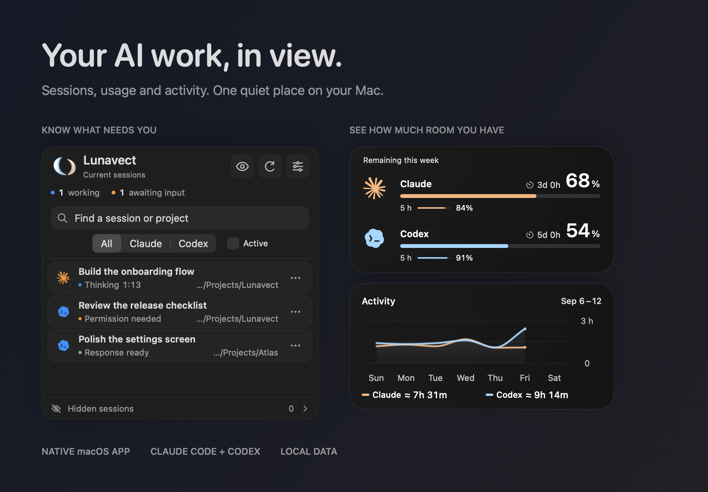
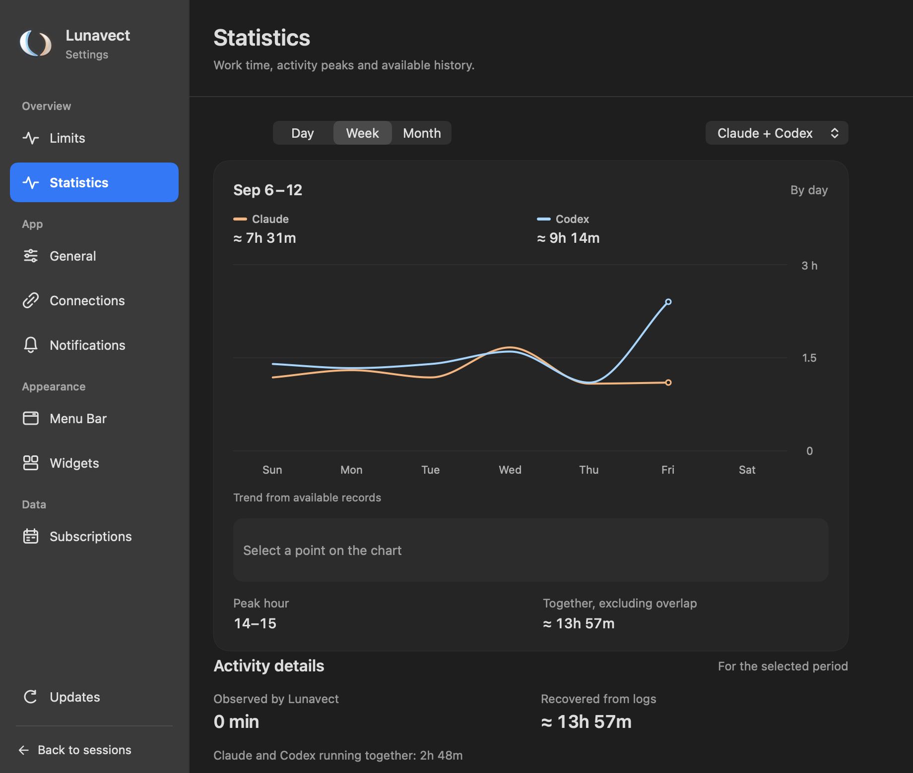

<p align="center">
  
</p>

<h1 align="center">Lunavect — Claude Code &amp; Codex<br>Status Bar + Widgets for macOS</h1>

<p align="center"><strong>Your AI coding sessions, usage limits and activity in one place.</strong><br>
Know what's working, what needs you, and how much usage you have left.</p>

<p align="center">
  <a href="https://github.com/lovach/Lunavect/releases/download/v0.1.0/Lunavect-0.1.0.dmg"></a>
</p>

<p align="center">
  macOS 14+ · Apple silicon &amp; Intel · Free &amp; open source<br>
  <a href="https://github.com/lovach/Lunavect/releases/latest">Release notes</a> ·
  <a href="#install">Installation</a> ·
  <a href="https://github.com/lovach/Lunavect/issues">Report a problem</a>
</p>

<picture>
  <source media="(prefers-color-scheme: dark)" srcset="docs/images/showcase-dark.png">
  <source media="(prefers-color-scheme: light)" srcset="docs/images/showcase-light.png">
  
</picture>

## A little less switching. A lot more clarity.

Keep your work in the official clients. Lunavect is a native macOS status bar app that gives you a shared view of Claude Code and Codex, with desktop widgets for usage limits and activity. Connect either client or both.

| Sessions | Usage | Activity |
| --- | --- | --- |
| See work in progress, requests for permission, and finished responses. Jump back to a session, pin it, reorder it, or hide it from the panel. | Check weekly and five-hour allowances and reset times. See model-specific Claude limits when available. | Explore locally recorded working time by day, week or month, with project and session breakdowns. |

## Take a closer look

Real native interface, shown with fictional sessions and sample data. Click any image to view it at full size. Widget images show the app's native layouts; macOS controls desktop placement and refresh.

<table>
  <tr>
    <td width="50%" valign="top">
      <a href="docs/images/sessions-themes.png"></a>
      <strong>Your sessions, at a glance</strong><br>
      Working, waiting and ready states. Light and dark appearances.
    </td>
    <td width="50%" valign="top">
      <a href="docs/images/widgets.png"></a>
      <strong>Widgets that fit your desktop</strong><br>
      Small, medium and large. Limits, activity, or both.
    </td>
  </tr>
  <tr>
    <td width="50%" valign="top">
      <a href="docs/images/limits.png"></a>
      <strong>Know your remaining allowance</strong><br>
      Both services and their next reset times in one view.
    </td>
    <td width="50%" valign="top">
      <a href="docs/images/activity.png"></a>
      <strong>See where the work happened</strong><br>
      Activity over time, with detail by project and session.
    </td>
  </tr>
</table>

**Make it yours.** Choose a menu-bar companion, a compact status layout, and optional sounds or notifications. Use English, Russian, German, Spanish, French, or Simplified Chinese. Signed updates arrive through the app.

## Install

1. **[Download Lunavect for macOS](https://github.com/lovach/Lunavect/releases/download/v0.1.0/Lunavect-0.1.0.dmg)** (DMG, about 10 MB).
2. Open the DMG, drag **Lunavect** to **Applications**, then open it there.
3. Choose **Connect Claude** or **Connect Codex**. The guide helps you find or install the official client and sign in through it.

The release app is **Developer ID signed and notarized by Apple**. One download includes Apple silicon and Intel code. The current release has been tested on an Apple silicon Mac; Intel and other macOS versions still need testing on real devices.

Claude usage requires **Claude Code CLI**; Claude Desktop alone is not enough. Codex usage comes from the official local Codex client. You only need the service you choose. Allowances depend on what the client exposes for your account; missing values stay unavailable.

**Add a desktop widget:** right-click the desktop → **Edit Widgets** → search **Lunavect**. Choose a size, then right-click the placed widget → **Edit Widget** to customize it.

<details>
<summary><strong>Downloads, updates and troubleshooting</strong></summary>

- The **DMG** is the installer to download. The ZIP and `appcast.xml` on the release page support the built-in updater; you don't need them for installation.
- Find every version and `SHA256SUMS.txt` on the [Releases page](https://github.com/lovach/Lunavect/releases).
- Use **Settings → Updates** to check for a newer version or change automatic download preferences.
- If a service stops updating, open **Settings → Connections** and follow its repair guidance. See [connections and removal](docs/connections.md).
- Before deleting Lunavect, disconnect its event handlers in **Settings → Connections** so the previous Claude status line can be restored.

</details>

## Local by design

No Lunavect account. No analytics backend. No provider passwords or API keys to paste into the app. Authentication stays with the official Claude and Codex clients.

Session names, project paths and activity records stay on your Mac. Lunavect reads local client data and sets up local event handlers with your connection choices. GitHub receives normal update requests, without your session information. Official clients and their installers make their own network requests.

[Connection details](docs/connections.md) · [How activity is counted](docs/activity.md)

## Current status

Lunavect is an early release. Session state depends on client events; widgets refresh on macOS's schedule. Experimental widget transparency is off by default. The optional closed-lid keep-awake mode needs testing on your Mac. See [compatibility and verified checks](docs/verification.md) for the current limits.

## Build and contribute

Use a full Xcode installation with a compatible Swift toolchain, then run:

```sh
./scripts/check.sh
```

This runs tests and builds the universal Release app, helpers and WidgetKit extension without a signing account. See the [development guide](docs/development.md) for setup and focused checks, and [update packaging](docs/updates.md) for distribution.

Found a bug? [Open an issue](https://github.com/lovach/Lunavect/issues/new/choose) with your macOS version and steps to reproduce. Please remove private session titles, paths and credentials from attachments.

## License and credits

Original Lunavect code is [MIT licensed](LICENSE). Third-party software, artwork and marks have separate terms in [NOTICE](NOTICE). Lunavect is independent of Anthropic and OpenAI; their names, marks and mascots belong to their respective owners.
