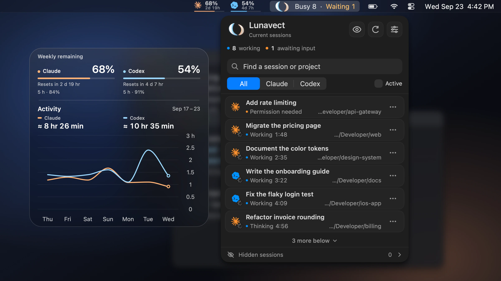
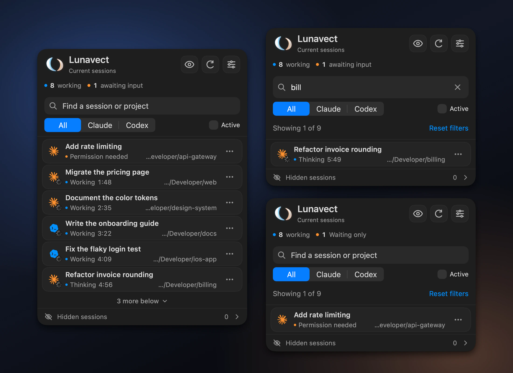
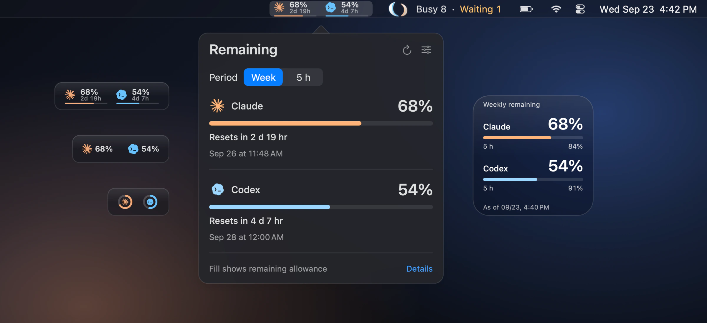
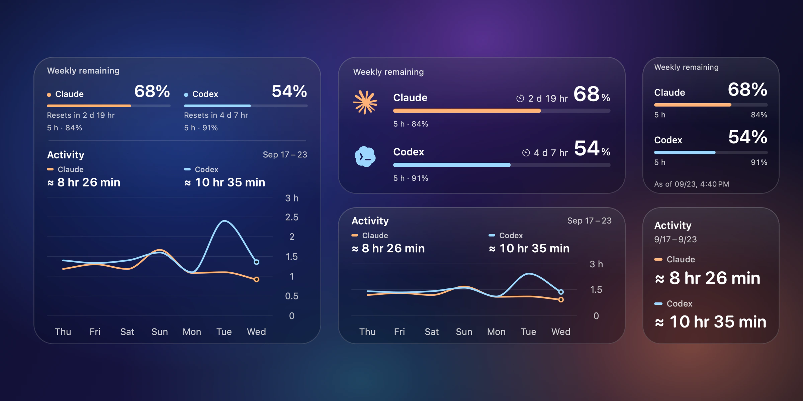
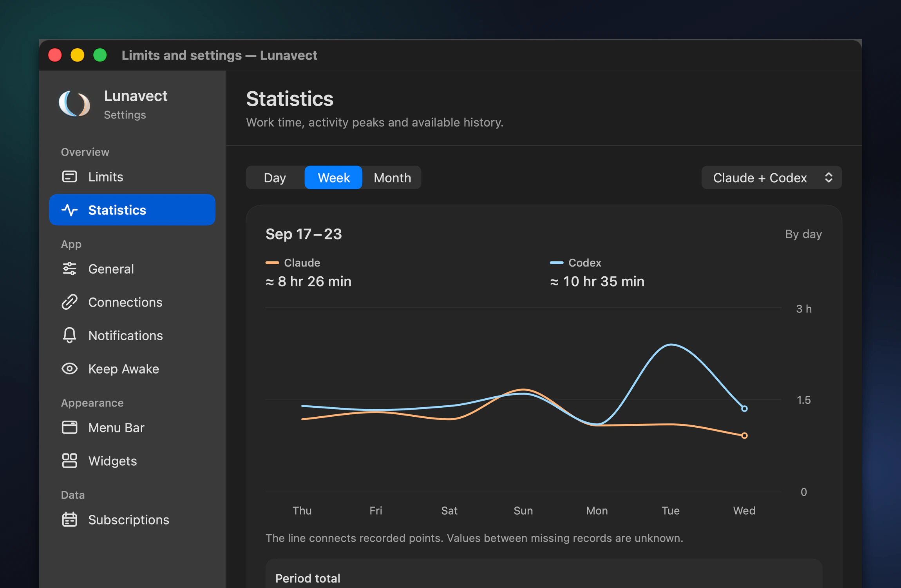
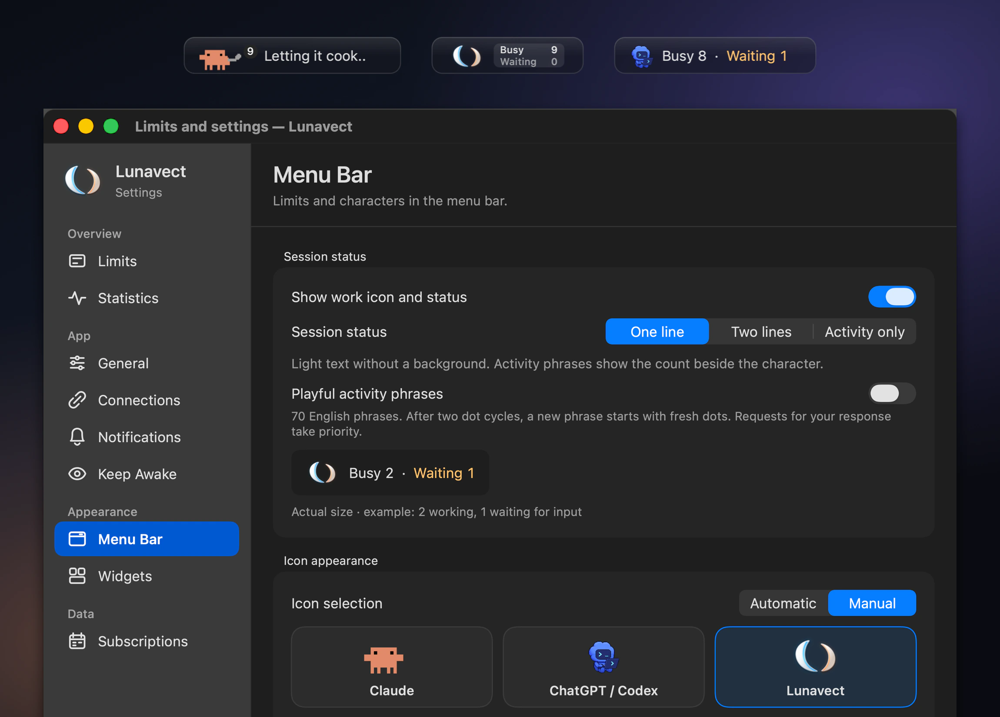

<div align="center">


# Lunavect

**The menu bar companion for Claude Code and Codex on your Mac.**<br>
See which AI coding agent is working, which one is waiting for you<br>
and how much of your weekly and five-hour usage limits is left.

<a href="https://github.com/lovach/Lunavect/releases/download/v0.1.9/Lunavect-0.1.9.dmg"></a>

<sub>Version 0.1.9 · macOS 14 or later · Apple silicon and Intel · Free and open source</sub>

<br>

<picture>
  <source media="(prefers-color-scheme: dark)" srcset="docs/images/showcase/hero-dark.webp">
  <source media="(prefers-color-scheme: light)" srcset="docs/images/showcase/hero-light.webp">
  
</picture>

<sub>The real app with fictional sessions and data.</sub>

[Features](#features) · [Install](#install) · [FAQ](#faq) · [Website](https://lovach.github.io/Lunavect/) · [Release notes](CHANGELOG.md)

</div>

## Features

<div align="center">

### Know which agent needs you

Every Claude Code and Codex task on your Mac in one panel, with its live state:<br>
working, thinking, waiting for permission or input, or done.<br>
Search, filter, pin and hide sessions. Live Terminal and iTerm2 sessions open in their own tab.



### Usage limits at a glance

Weekly and five-hour allowances for Claude and Codex, with reset times.<br>
Show them in the menu bar as bars, percentages or rings. Unknown values stay unknown.



### Desktop widgets

Limits, activity or both, in small, medium and large sizes.<br>
Choose a solid background or adjustable glass.



### See where your time goes

Working time by day, week and month for each provider,<br>
with project and session breakdowns. Recovered history is marked as approximate.



### Make it yours

Pick the Claude, Codex or Lunavect character, a one-line, two-line or activity-only status,<br>
and playful activity phrases while your agents work.



**Also included:** notifications when a response is ready or an approval is needed ·<br>
Keep Awake while agents work · light and dark appearance · English, Russian, German, Spanish, French and Simplified Chinese

</div>

## Install

**With Homebrew**

```sh
brew tap lovach/lunavect https://github.com/lovach/Lunavect
brew install --cask lovach/lunavect/lunavect
```

**Or download** [Lunavect-0.1.9.dmg](https://github.com/lovach/Lunavect/releases/download/v0.1.9/Lunavect-0.1.9.dmg), open it and drag Lunavect to Applications. Every release is Developer ID signed and notarized by Apple, and updates arrive through Settings → Updates.

Then choose **Connect Claude** or **Connect Codex**. Claude needs Claude Code CLI; Claude Desktop alone is not enough. Codex needs the official Codex app or CLI. Connect one provider or both. Sign-in stays with the official clients.

[Setup, updates and uninstall](docs/installation.md) · [Compatibility and known limitations](docs/verification.md)

## FAQ

<details>
<summary><b>Can I use only Claude Code or only Codex?</b></summary>
<br>
Yes. Connect either provider or both. Claude needs Claude Code CLI; Claude Desktop alone is not enough.
</details>

<details>
<summary><b>Do I need an account or an API key?</b></summary>
<br>
No Lunavect account or pasted API key is required. Sign-in stays with the official clients, and the available allowances depend on your plan.
</details>

<details>
<summary><b>Why is a limit unavailable or a widget behind the app?</b></summary>
<br>
Limits need fresh data from the client, and missing or expired values are shown as unavailable instead of guessed. Widgets read saved data and refresh when macOS schedules them. Check Connections and the timestamp of the value.
</details>

<details>
<summary><b>Is activity the same as token usage?</b></summary>
<br>
No. It measures working intervals. Recovered history is marked <code>≈</code>, and overlapping sessions are counted once in the combined total.
</details>

<details>
<summary><b>Does Lunavect send my sessions anywhere?</b></summary>
<br>
No. Session titles, project paths and activity history stay on your Mac. There is no account system or analytics backend; update checks go to GitHub without session data.
</details>

[All questions and answers](docs/faq.md) · [Installation and troubleshooting](docs/installation.md)

## Privacy

Lunavect reads local client data and adds its event handlers when you connect a provider, keeping unrelated configuration intact. It extracts only session identity, state and timing, and never saves a copy of your conversations. [Privacy and permissions](docs/privacy.md) · [Connection details](docs/connections.md) · [How activity is counted](docs/activity.md)

## Development

Requires full Xcode and a compatible Swift toolchain.

```sh
git clone https://github.com/lovach/Lunavect.git
cd Lunavect
./scripts/check.sh
```

The check runs the tests and builds the universal Release app, helpers and WidgetKit extension without a signing account. [Contributing](.github/CONTRIBUTING.md) · [Development guide](docs/development.md) · [Documentation](docs/README.md) · [Security reports](.github/SECURITY.md)

Bug reports should include the macOS version and steps to reproduce; remove private session titles, paths and credentials from attachments. Ideas are welcome in [Issues](https://github.com/lovach/Lunavect/issues/new?template=feature.yml).

## License

[MIT](LICENSE) for original Lunavect code. Third-party software and artwork are covered in [NOTICE](NOTICE). Lunavect is independent of Anthropic and OpenAI.
