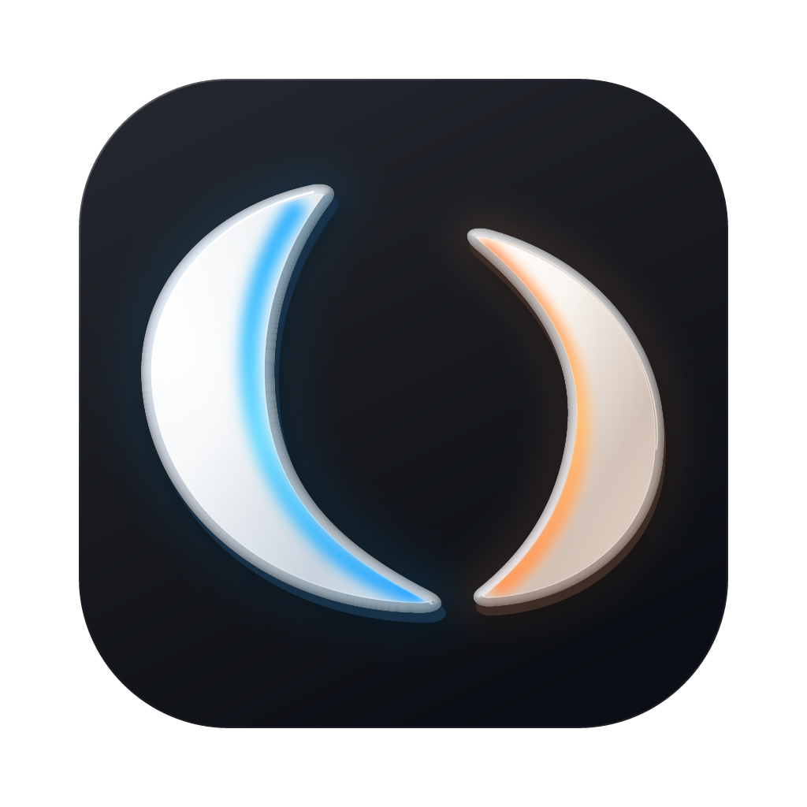
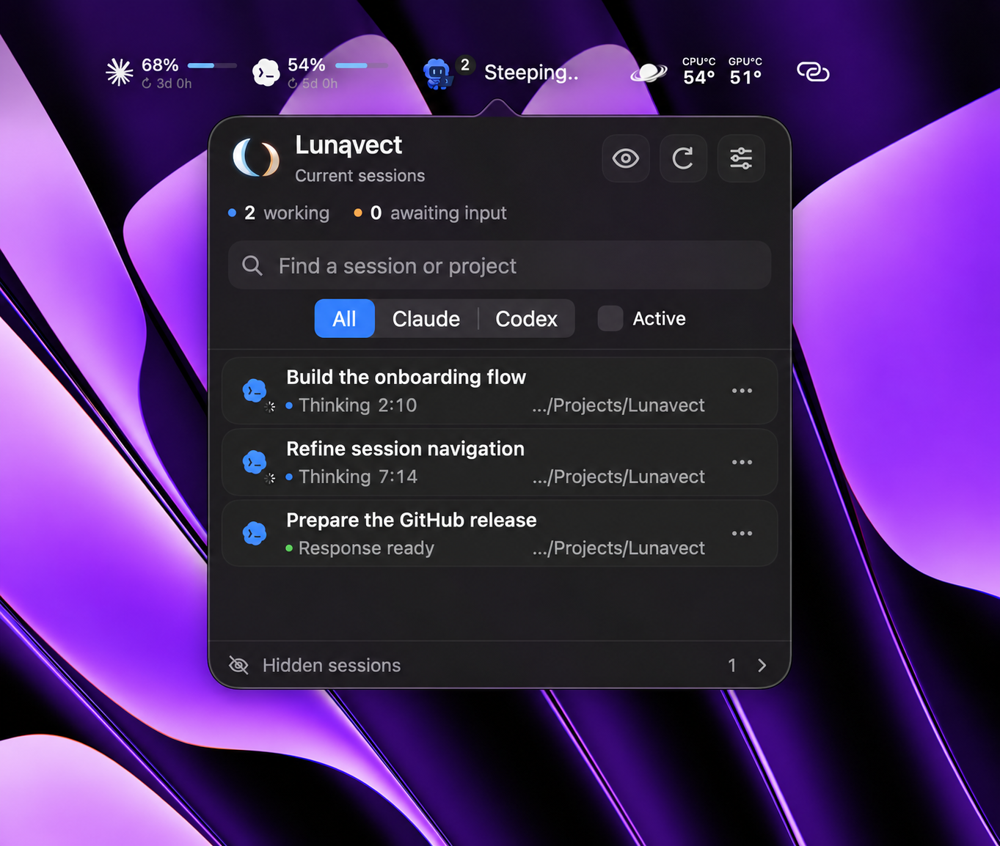
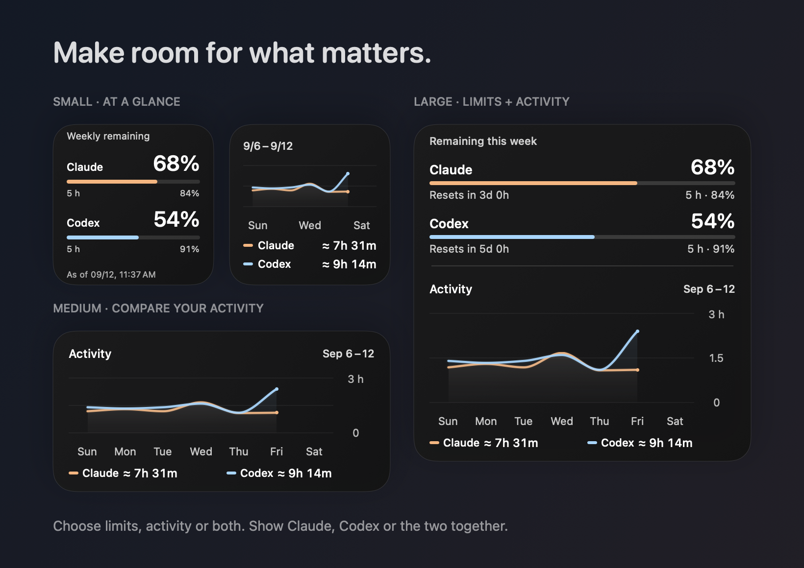
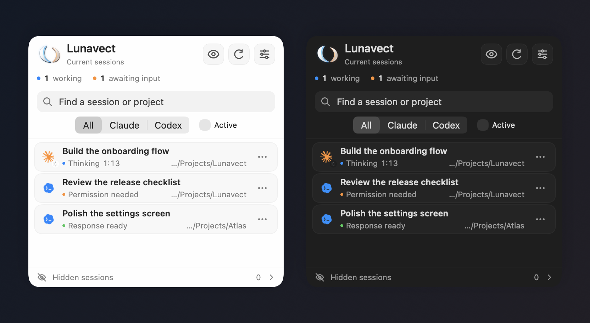
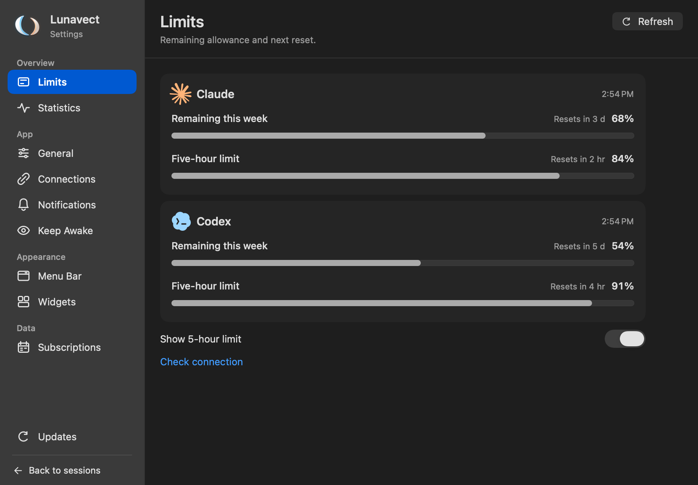
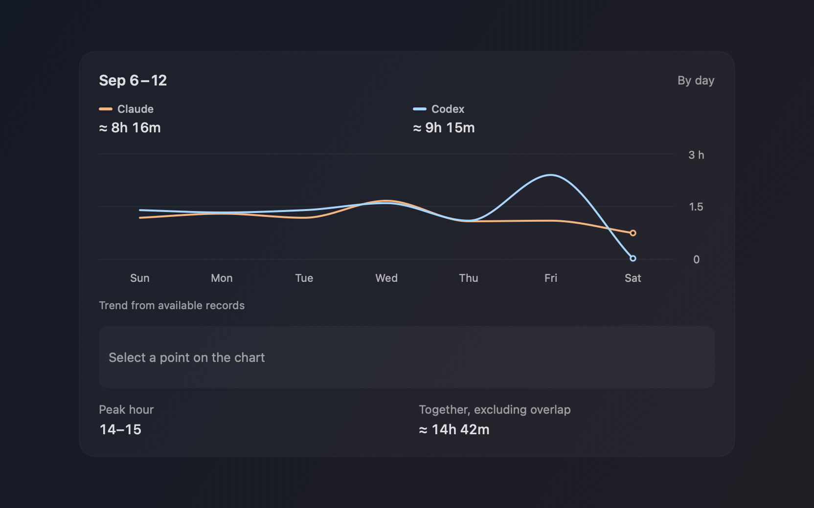

<div align="center">



# Lunavect

A macOS menu bar app and desktop widgets for **Claude Code** and **Codex**.

<p>
  <a href="https://github.com/lovach/Lunavect/releases/download/v0.1.0/Lunavect-0.1.0-installer-2.dmg"></a>
</p>

macOS 14+ · Apple silicon & Intel · Free and open source

[Install](#install) · [Screenshots](#screenshots) · [Release notes](CHANGELOG.md) · [Report a bug](https://github.com/lovach/Lunavect/issues/new?template=bug.yml)

## Features

<p>
  <a href="docs/images/macos-menu-bar.png"></a>
</p>

<p>
Claude Code and Codex sessions in one panel: working, waiting for input, or response ready.<br>
Search by session or project. Filter, pin, reorder and hide sessions.<br>
Weekly and five-hour usage limits with reset times.<br>
Small, medium and large desktop widgets for limits and activity.<br>
Activity charts by day, week or month, with available project and session breakdowns.
</p>

<sub>Retouched macOS capture with sample data. Menu-bar usage indicators are a development preview and are not in 0.1.0. [Screenshot notes](docs/verification.md#public-screenshots).</sub>

## Install

### Install with Homebrew

<div align="left">

```sh
brew tap lovach/lunavect https://github.com/lovach/Lunavect
brew install --cask lovach/lunavect/lunavect
open -a Lunavect
```

</div>

Or [download the DMG](https://github.com/lovach/Lunavect/releases/download/v0.1.0/Lunavect-0.1.0-installer-2.dmg) and drag **Lunavect** to **Applications**. The release is Developer ID signed and notarized by Apple.

Open **Connect Claude** or **Connect Codex** in Lunavect. Claude requires **Claude Code CLI**; Claude Desktop alone is not enough. Connect either service or both. Sign-in stays with the official clients.

[Setup, updates and uninstall](docs/installation.md) · [Compatibility and known limitations](docs/verification.md)

## Screenshots

Native interface with sample sessions and usage data. Click an image to enlarge it.

### Desktop widgets

Limits, activity, or a combined overview. macOS manages placement and refresh.

<p>
  <a href="docs/images/widgets.png"></a>
</p>

<details>
<summary>Session panel — light and dark</summary>

[](docs/images/sessions-themes.png)

</details>

<details>
<summary>Usage limits and activity details</summary>

[](docs/images/limits.png)

[](docs/images/activity-detail.png)

</details>

## Data and connections

Session titles, project paths and activity history stay on your Mac. Lunavect reads local client data and configures event handlers when you connect a service. It has no account system or analytics backend. Update checks go to GitHub without session data; the official clients make their own network requests.

Activity measures working intervals. Recovered history is marked as approximate. Missing or expired usage limits remain unavailable.

[Connection details](docs/connections.md) · [How activity is counted](docs/activity.md)

## Development

Requires full Xcode and a compatible Swift toolchain.

<div align="left">

```sh
git clone https://github.com/lovach/Lunavect.git
cd Lunavect
./scripts/check.sh
```

</div>

The check runs tests and builds the universal Release app, helpers and WidgetKit extension without a signing account.

[Development guide](docs/development.md) · [GitHub Actions](https://github.com/lovach/Lunavect/actions/workflows/ci.yml) · [Release checks](docs/verification.md)

Bug reports should include the macOS version and steps to reproduce. Remove private session titles, paths and credentials from attachments. For testing on another Mac, use the [first-install checklist](docs/first-install-check.md). Feature requests are welcome in [Issues](https://github.com/lovach/Lunavect/issues/new?template=feature.yml).

## License

[MIT](LICENSE) for original Lunavect code. Third-party software and artwork are covered separately in [NOTICE](NOTICE). Lunavect is independent of Anthropic and OpenAI.

</div>
