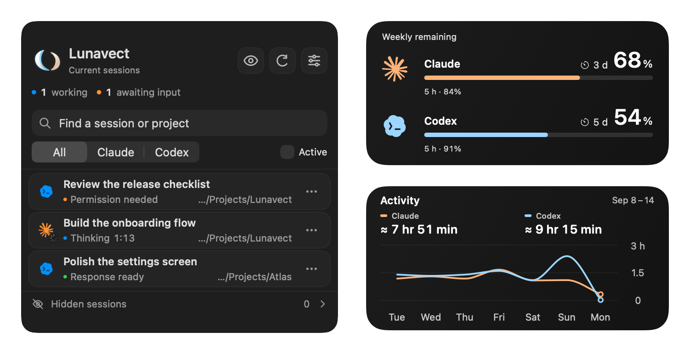
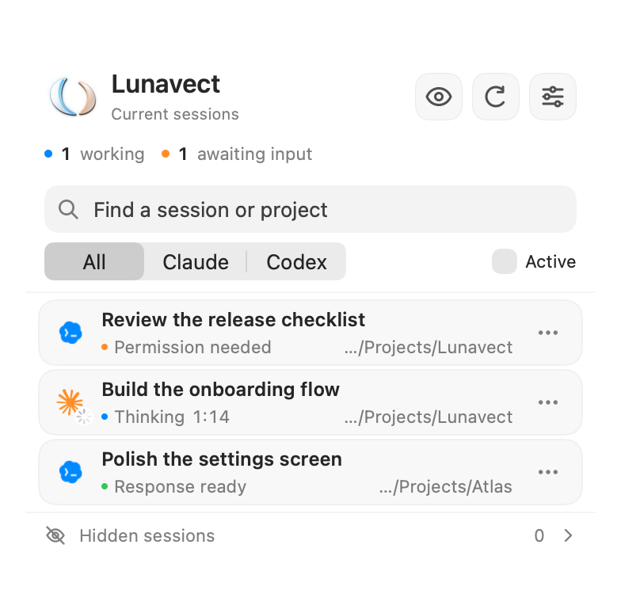
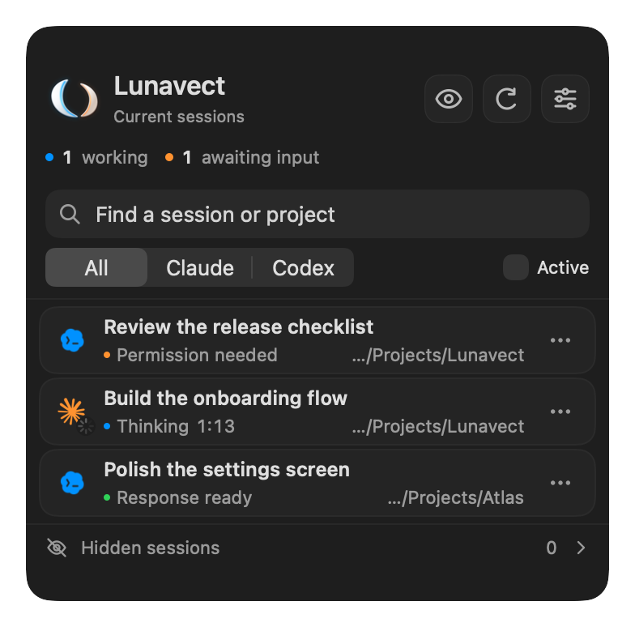
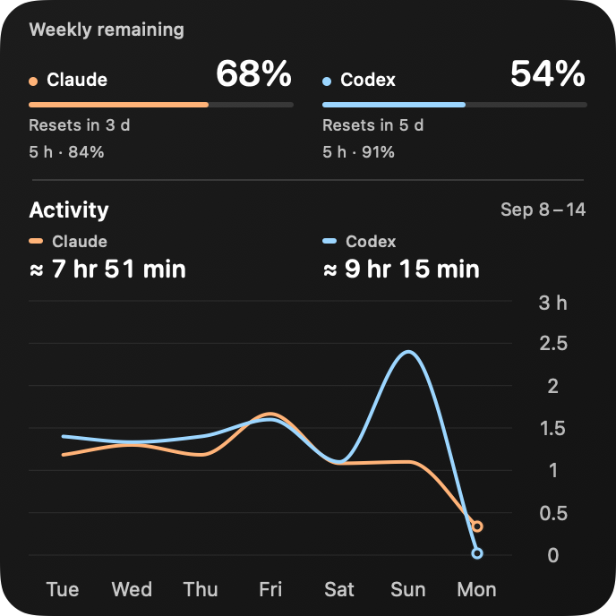
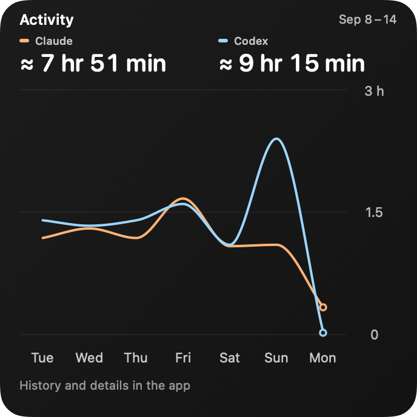
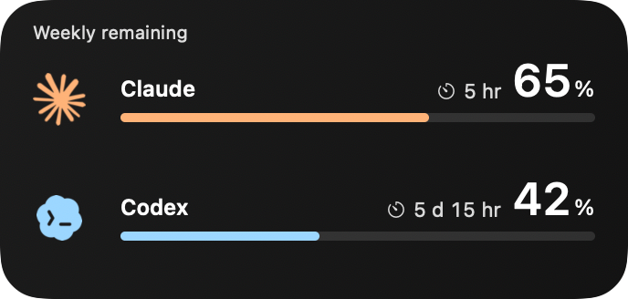
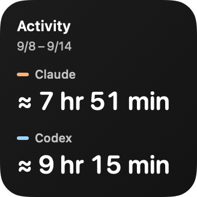
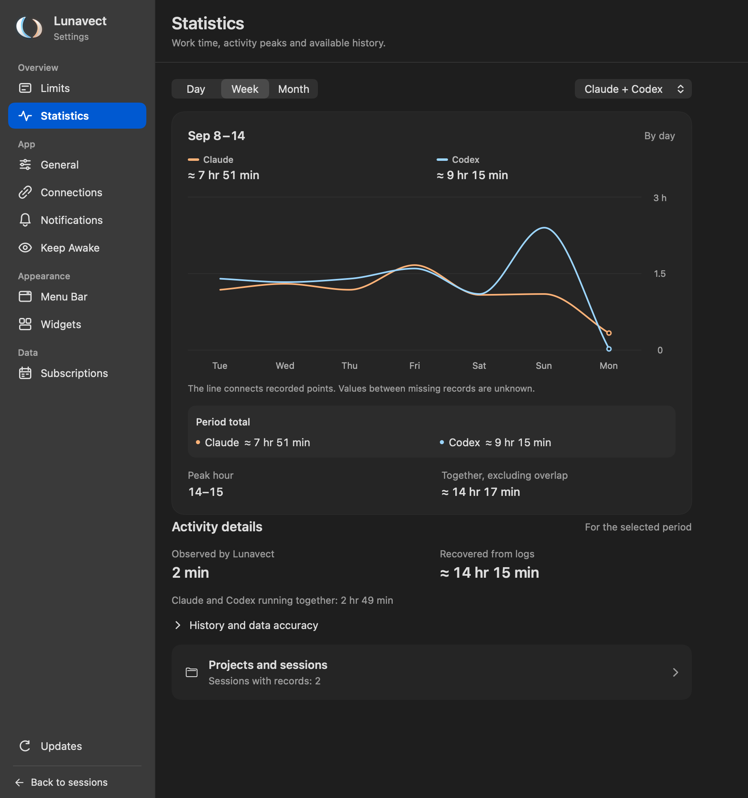
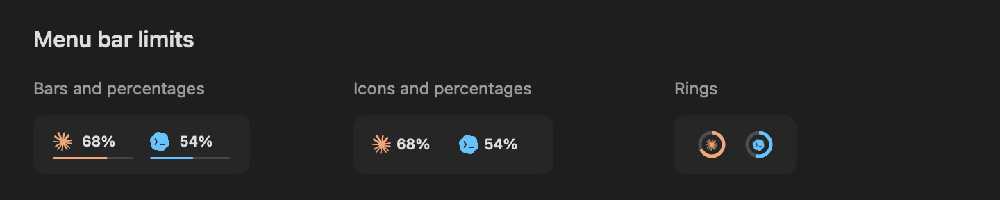
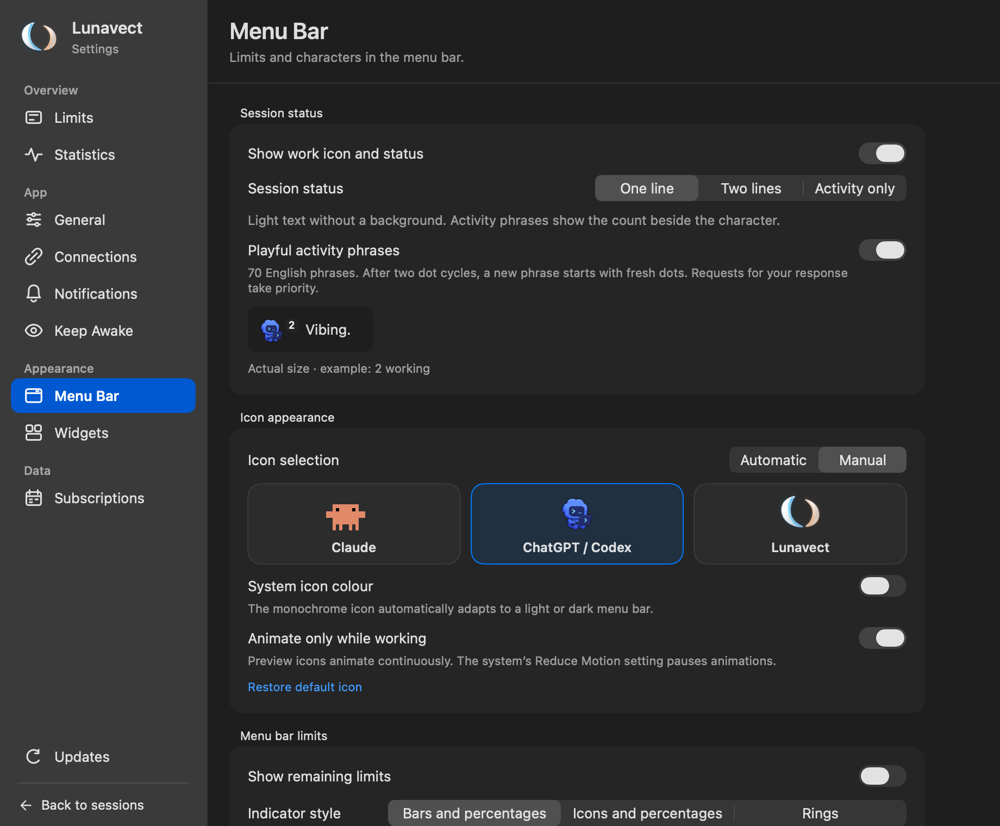

<div align="center">


# Lunavect

A macOS menu bar app and desktop widgets for **Claude Code** and **Codex**.

<p>
  <a href="https://github.com/lovach/Lunavect/releases/download/v0.1.2/Lunavect-0.1.2.dmg"></a>
</p>

macOS 14+ · Apple silicon & Intel · Free and open source

[Sessions](#sessions) · [Usage limits](#usage-limits) · [Widgets](#desktop-widgets) · [Install](#install) · [Release notes](CHANGELOG.md)

<p>
  <a href="docs/images/readme-overview-dark.png">
    <picture>
      <source media="(max-width: 600px) and (prefers-color-scheme: light)" srcset="docs/images/readme-sessions-light.png">
      <source media="(max-width: 600px)" srcset="docs/images/readme-sessions-dark.png">
      <source media="(prefers-color-scheme: dark)" srcset="docs/images/readme-overview-dark.png">
      <source media="(prefers-color-scheme: light)" srcset="docs/images/readme-overview-light.png">
      
    </picture>
  </a>
</p>

<sub>Current interface, captured on September 14, 2026 with fictional data. [About the screenshots](docs/verification.md#public-screenshots).</sub>

## Install

### Install with Homebrew

<div align="left">

```sh
brew tap lovach/lunavect https://github.com/lovach/Lunavect
brew install --cask lovach/lunavect/lunavect
open -a Lunavect
```

</div>

Or [download the DMG](https://github.com/lovach/Lunavect/releases/download/v0.1.2/Lunavect-0.1.2.dmg) and drag **Lunavect** to **Applications**. The release is Developer ID signed and notarized by Apple.

Open **Connect Claude** or **Connect Codex** in Lunavect. Claude requires **Claude Code CLI**; Claude Desktop alone is not enough. Connect either service or both. Sign-in stays with the official clients.

[Setup, updates and uninstall](docs/installation.md) · [Compatibility and known limitations](docs/verification.md)

## Screenshots

### Sessions

See which task is working, needs input or has finished.<br>
Search by session or project. Filter, pin, reorder and hide sessions.

<p>
  <a href="docs/images/readme-sessions-light.png"></a>
  <a href="docs/images/readme-sessions-dark.png"></a>
</p>

### Usage limits

Weekly and five-hour allowances, with a reset time for each provider.<br>
Missing or expired limits stay marked as unavailable.

<p>
  <a href="docs/images/limits.png"></a>
</p>

### Desktop widgets

Small, medium and large layouts for limits, activity or both.<br>
Choose a solid background or adjustable glass in Settings → Widgets.<br>
macOS manages placement and refresh; glass is experimental and off by default.

<p>
  <a href="docs/images/widget-overview.png"></a>
  <a href="docs/images/widget-activity-large.png"></a>
</p>
<p>
  <a href="docs/images/widget-limits.png"></a>
  <a href="docs/images/widget-activity-small.png"></a>
</p>

### Activity

Working time by day, week and month, with project and session breakdowns.<br>
Recovered history is marked as approximate.

<p>
  <a href="docs/images/readme-activity.png"></a>
</p>

### Menu bar

Choose bars and percentages, compact icons and percentages, or rings.<br>
The compact mode removes the bars and reduces the height of the indicator.

<p>
  <a href="docs/images/menu-bar.png"></a>
</p>

### Make it yours

Choose a character and session-status style, or let Lunavect pick the character automatically.<br>
Activity phrases switch after two dot cycles. Input and approval requests take priority.

<p>
  <a href="docs/images/settings-menu-bar.png"></a>
</p>

All images open at full resolution when clicked. Session names, paths and usage values are samples.

## FAQ

**Can I use only Claude or only Codex?**<br>
Yes. Connect either provider or both. Claude requires Claude Code CLI; Claude Desktop alone is not enough.

**Do I need another account or an API key?**<br>
No Lunavect account or pasted API key is required. Sign-in stays with the official clients; available allowances depend on your account.

**Why is a limit unavailable or a widget behind the app?**<br>
Limits need fresh data from the client. Widgets read saved data and refresh when macOS schedules them. Check Connections and the value's timestamp.

**Is activity the same as token usage?**<br>
No. It measures working intervals. Recovered history is marked `≈`, and overlapping sessions are counted once in the combined total.

[All questions and answers](docs/faq.md) · [Installation and troubleshooting](docs/installation.md)

## Data and connections

Session titles, project paths and activity history stay on your Mac. Lunavect reads local client data and configures event handlers when you connect a service. It has no account system or analytics backend. Update checks go to GitHub without session data; the official clients make their own network requests.

Activity measures working intervals. Recovered history is marked as approximate. Missing or expired usage limits remain unavailable.

[Privacy and permissions](PRIVACY.md) · [Connection details](docs/connections.md) · [How activity is counted](docs/activity.md)

## Development

Requires full Xcode and a compatible Swift toolchain.

<div align="left">

```sh
git clone https://github.com/lovach/Lunavect.git
cd Lunavect
./scripts/check.sh
```

</div>

The check runs tests and builds the universal Release app, helpers and WidgetKit extension without a signing account.

[Contributing](CONTRIBUTING.md) · [Development guide](docs/development.md) · [GitHub Actions](https://github.com/lovach/Lunavect/actions/workflows/ci.yml) · [Release checks](docs/verification.md)

Bug reports should include the macOS version and steps to reproduce. Remove private session titles, paths and credentials from attachments. For testing on another Mac, use the [first-install checklist](docs/first-install-check.md). Feature requests are welcome in [Issues](https://github.com/lovach/Lunavect/issues/new?template=feature.yml).

[Documentation](docs/README.md) · [FAQ](docs/faq.md) · [Security reports](SECURITY.md)

## License

[MIT](LICENSE) for original Lunavect code. Third-party software and artwork are covered separately in [NOTICE](NOTICE). Lunavect is independent of Anthropic and OpenAI.

</div>
