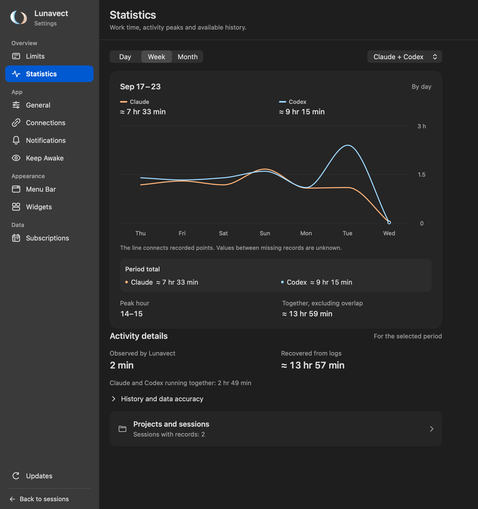
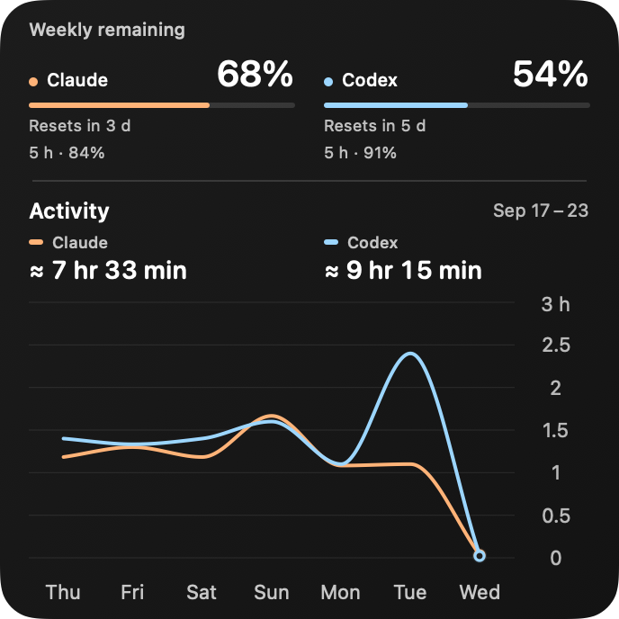
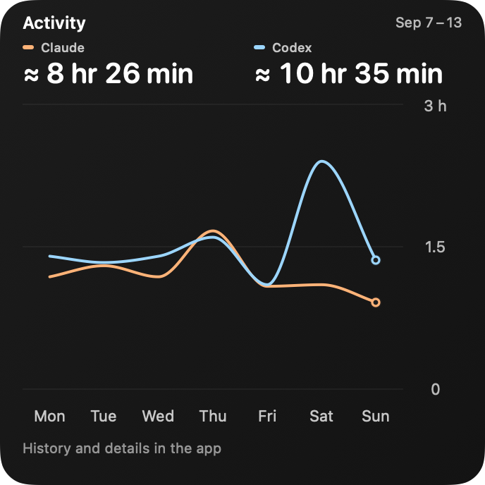
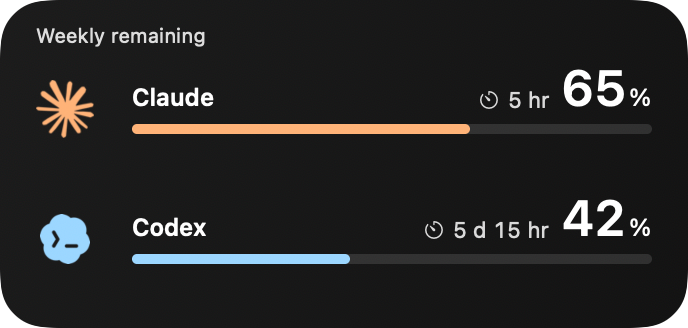
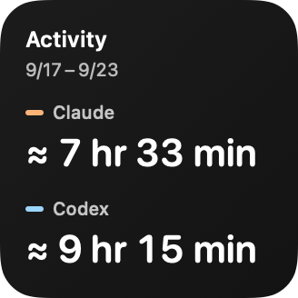

# Activity and desktop widgets

Activity shows available working time for Claude Code and Codex. It is a local estimate from session states and timing records, not token usage, CPU time or a billing meter.

## Choose a widget

| Widget | Sizes | Contents |
| --- | --- | --- |
| Limits | Small, medium | Weekly remaining allowances and optional five-hour values |
| Activity | Small, medium, large | Claude and Codex activity together, or one provider, for the selected period |
| Overview | Large | Remaining allowances, an activity chart and provider totals |

Right-click the desktop, choose **Edit Widgets** and search for **Lunavect**. Add the size you want. For an activity or overview widget, right-click the placed widget and choose **Edit Widget** to set its period and source.

The gallery inside Lunavect is a preview. Changing its content, size, period or source does not add a widget or change one already on the desktop. The add-widget guide explains the macOS steps; it does not place a widget automatically.

   

## Periods and sources

- **Day:** the current calendar day, by hour.
- **Week:** today and the six preceding days.
- **Month:** today and the 29 preceding days.

Periods use your current time zone. A daylight-saving transition can produce 23 or 25 hours in a day. Choose both providers or one; disabling a provider does not substitute another provider's data.

The peach series represents Claude and the blue series represents Codex. Each point is an hourly or daily total, not a cumulative total. Provider totals cover the displayed period. The current hour or day may still be incomplete.

## Reading the chart

In **Settings → Statistics**, hover over a point for its values or click to keep it selected. Arrow keys move the selection; Escape or the clear control returns to the period view. Selecting a point also narrows the project breakdown to that hour or day.

Below the chart, the app shows observed and recovered time and provider overlap. After the history section, **Projects and sessions** shows a count and opens a separate panel. Search and **Done** stay above the scrolling project list; Escape closes the panel. The number of projects does not increase the height of the main statistics page.

Selecting a chart point narrows the breakdown to that hour or day. **Entire period**, Escape or clicking the selected point again clears selection and focus. Without a selected point, the value summary shows the period total (the current hour in Day view), while the breakdown covers the entire period. Search by session, project or provider. Records without a reliable project association remain in the overall total rather than being assigned to a made-up project.

A missing observation is different from a known zero. The trend may connect known points across an internal gap, but that line does not create measured work in the gap. Leading or trailing unknown intervals are not extended as if observed. Check the history and data-accuracy section for source freshness and recovery details.

## What counts as work

Live collection counts a short interval only when a session is freshly reported as running at both ends. Waiting for input or permission, ready, idle, unknown, disappeared sessions and long observation gaps are not counted as observed work. Two observations may be up to three poll steps plus 5 seconds apart (20 seconds with the 5-second idle poll), because reading titles or a slow disk can delay one. Longer gaps with the same session running at both ends are not counted; the history section shows how many there were and their total length. Restarting the app, sleep and wake always start a new observation; they do not fill the gap. If the clock is set back, time already recorded is not counted twice, and recording continues after the clock is corrected. A clock set more than 35 days ahead removes the older history, as a long absence would.

A short task that starts and finishes between observations can be missed. Hidden sessions are still eligible for collection because hiding changes presentation, not whether a task is working.

Each provider's total counts its concurrent sessions once. The combined total counts time when at least one selected provider worked. For example, if Claude and Codex both run for ten minutes at the same time, each gets ten minutes and the combined total is ten minutes. The two provider totals can therefore add up to more than the combined total.

Project totals also merge overlapping sessions within a project. Different projects may overlap, so their totals are not necessarily additive. Peak hour describes the available records for the selected period; it is not a forecast or a measure of complete coverage.

## Recovering earlier history

Lunavect can recover recent timing records from local client logs, including work before its first observation. It marks recovered time with `≈`. These durations can be approximate and may include waiting; they are kept distinct from live observations.

Recovery uses available timing metadata from Codex session and archived-session logs and Claude project logs. Codex tasks use their recorded start and completion. Claude turns are rebuilt from message timestamps: a typed prompt starts a turn and the last assistant reply or Stop hook summary before the next prompt ends it. Tool results, subagent (sidechain), meta and compaction rows never start a turn, a prompt without a reply is not counted, a silence of more than 30 minutes inside a turn (for example an unanswered permission request) is left out, and so is the time a question to you (`AskUserQuestion`) or a plan waiting for your approval (`ExitPlanMode`) waits for the answer. A long autonomous turn counts in full, like live observation and Codex tasks. One difference from live observation remains: the logs do not mark a permission prompt, so a permission request answered within 30 minutes is counted as part of the turn, while live observation shows it as **Permission needed** and does not count it. Claude's own turn, subagent and tool durations are read as well and merged, so overlapping records are counted once. Like Codex tasks, a turn includes tool runs and model latency. It does not turn every conversation, file timestamp or unfinished task into measured work. Unsupported, inconsistent or incomplete timing records can be skipped. Client formats and the available files determine how much can be recovered.

Recovery runs on initial setup, when a provider is enabled for the first time, and when an importer update requires it. Each provider keeps its own boundary at the start of its observations. A repeated import reads only logs created before that boundary, and none at all when the boundary is older than the 35-day window; a log copied into place later (for example restored from a backup) can therefore be left out. **Refresh history** retries against those stored boundaries. The history section shows the outcome; an empty import is not proof that no work happened. Only lost coverage (the read budget, unreadable or missing logs, symbolic links) marks the charts "From available records". Skipped individual records, such as a task still running during the import, are listed in the import details as information.

## Storage and refresh

Aggregate activity is stored in `activity.json` beside the shared quota snapshot. It contains intervals, provider coverage and recovery metadata, without session titles or project paths. The project/session breakdown is stored separately in `~/Library/Application Support/Weekleft/activity-details.json`; it includes identifiers, titles, paths and intervals and is not copied into the widget's shared history.

History is limited to 35 days. Aggregate storage is also capped at 50,000 intervals; detailed storage at 2,000 records, 100,000 intervals and about 24 MB, dropping the oldest records first so the file stays readable. Busy histories can cover less time. Files are written atomically; a corrupt file is preserved rather than silently replaced with empty data, and overlapping detail intervals are merged when loaded. If the shared history cannot be read at all (for example because it is larger than the read limit), collection pauses and the history section offers **Keep a copy and start over**: the file is kept beside the original as `activity.json.unreadable-…` and a new history starts with recent logs recovered. Only that button does this: launch, **Refresh history** and connecting a provider in the setup wizard leave the unreadable file untouched.

While work runs the app saves measured activity once a minute; it saves continuous idle coverage every five minutes, and a change in which sessions are running 15 seconds after the first unsaved change. Ready, idle, finished or hidden sessions changing phase do not cause a write. The project/session breakdown is written every five minutes without forcing a disk flush and after an import; on ordinary quit and before the Mac sleeps it is written with a disk flush. An app crash can lose the latest minute of activity and up to five minutes of the breakdown. A kernel panic or power loss within a few minutes after an unflushed write can leave that file empty; it is then kept aside as a corrupt copy and the breakdown starts again, while the aggregate history, which is always flushed, keeps its totals. Quitting waits at most 3 seconds for the disk for each of the two stores (quotas and activity). Activity widget reload requests are coalesced over fifteen minutes; saving an observation does not require a widget reload, and quota updates reload only the limits and overview widgets. WidgetKit reads saved observations and does not poll the providers itself. macOS decides when a requested widget refresh runs, so a widget may lag behind the app. The Statistics section of Settings marks data as outdated after five minutes without a live observation; activity widgets allow twenty minutes, their reload cadence plus the same margin, so a normal lag does not show the outdated badge.

Desktop placement and refresh across supported Macs remain separate compatibility checks. See [verification](verification.md) and [Apple's WidgetKit refresh guide](https://developer.apple.com/documentation/widgetkit/keeping-a-widget-up-to-date).

[Connections](connections.md) · [FAQ](faq.md) · [Privacy and storage locations](privacy.md)
