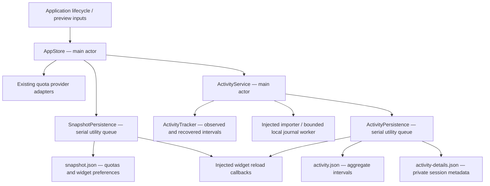

# Application data boundaries

Lunavect keeps its UI state on the main actor. File loading/writing and local
history import have separate owners; provider authentication remains in the
official clients. The compatibility-facing module and data names remain Weekleft.

`AppStore` retains quota refresh, selected providers, network/lifecycle handling
and bindings. It forwards activity publications from `ActivityService`; it no
longer owns activity file paths, encoders, recovery or the import worker.
`AppDataServices` accepts the two concrete services and an observation clock.
The existing `state`, `savesChanges`, `quotaFetcher`, `activityHistory`,
`activityDetails`, `isolated` and `defaults` initializer inputs remain supported,
including the trailing quota fetcher closure.

## Decisions and tradeoffs

1. **One queue per persistence responsibility.** Snapshot writes are FIFO. History
   and private details share a second FIFO queue, and each file remembers only
   its last successful value. `submit` returns before file I/O; `flush` enqueues
   behind preceding submissions and waits. The queue never waits for a main-actor
   callback. Result sequence numbers prevent an earlier asynchronous error from
   replacing the result of a later termination flush. There is no transaction
   across all three files: a partial activity write reports the failed side and
   retries it without rewriting an unchanged successful side.
2. **Deduplicate successful states, preserve retry.** Preference bursts retain the
   existing 200 ms coalescing. Equal quota/preferences and equal activity values
   do not rewrite successfully saved bytes or reload widgets. A failed write
   invalidates its comparison baseline because the writer may have changed the
   destination before failing. A missing or recovered file also requires a first
   write. Only successful history writes reload activity/overview widgets;
   private detail changes alone do not. Snapshot changes reload the three known
   widget kinds, since preferences can affect each of them.
3. **Startup and termination remain synchronous boundaries.** The existing
   initializer returns loaded values and recovery status; termination waits for
   the latest requested state. Both dispatch actual I/O onto utility queues, but
   the caller still waits at those two boundaries. This preserves initialization
   and shutdown contracts; it does not claim nonblocking startup or a bounded
   shutdown time on an unresponsive disk. Periodic activity writes, quota writes
   and import-boundary writes run asynchronously during normal operation.
4. **Import cancellation governs publication as well as execution.** The import
   boundary is saved before the worker starts. If that write fails, importing
   stops and an explicit retry uses the same boundary. Stop and provider changes
   cancel the owned task and advance its generation; late noncooperative results
   cannot merge into history. Repeated import requests coalesce into one retry.
   The core importer accepts a monotonic clock for deadline fixtures, checks
   cancellation during enumeration/parsing/finalization, and marks cancelled
   results with no usable payload. Deadline-limited results still contain valid
   accepted intervals and a partial report. Stop/provider transitions also break
   consecutive live observations, preventing a stopped interval from being counted.
5. **Isolation is stronger than disabling saves.** `isolated: true` overrides
   supplied disk services, creates memory-only activity state, suppresses local
   import/provider discovery/network startup and never writes shared preferences.
   Explicit fixture clocks and quota fetchers still work. `savesChanges: false`
   alone is the older read-only mode and does not promise environmental isolation.
   Production recovery retains backups and blocks writes to unreadable files;
   a failure reading private details does not disable healthy aggregate history.

## Verification and counters

`SnapshotPersistence` accepts explicit paths, read/recovery/write operations,
reload callbacks and a callback queue. `ActivityPersistence` accepts explicit
history/details paths, readers, writers and reload/callback queues.
`ActivityService` accepts an observation clock and an async importer with the
selected providers, persisted boundary and current observation time. These seams
are used by production code and synthetic tests rather than a separate test-only
storage implementation.

Both persistence services expose `PersistenceCounters` (`submitted`, `written`,
`skipped`, `failed`). Snapshot counters describe individual requests. For activity,
`written` means a request wrote at least one file and `failed` means at least one
file failed; a partially successful request can increment both. They are process
counters, not serialized user data or estimates of battery use.

Focused tests live in `AppStoreLifecycleTests`, `AppStoreDataServicesTests`,
`SnapshotPersistenceTests`, `ActivityPersistenceTests`, `ActivityServiceTests` and
the existing core activity suites. They use temporary files, fixed clocks,
controlled continuations and injected failures. They verify write order, final
flush, retry after partial write, recovery backups, unchanged-state deduplication,
late results, repeated start/stop and isolated stores. These checks do not certify
live client behavior, physical WidgetKit refresh, CPU/wakeup/RSS improvements or
battery life; those require separate measurements of the integrated app.
