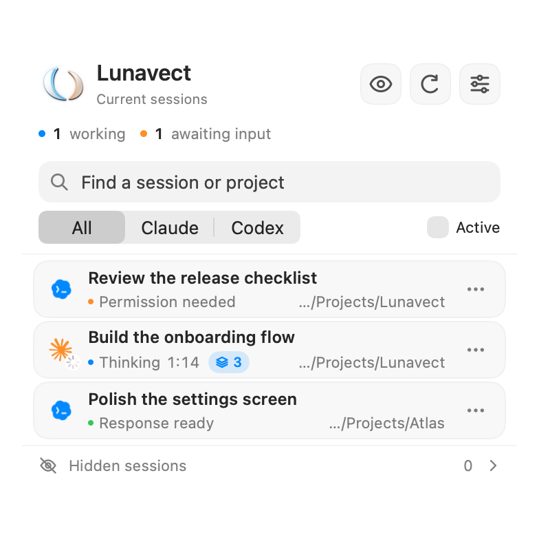
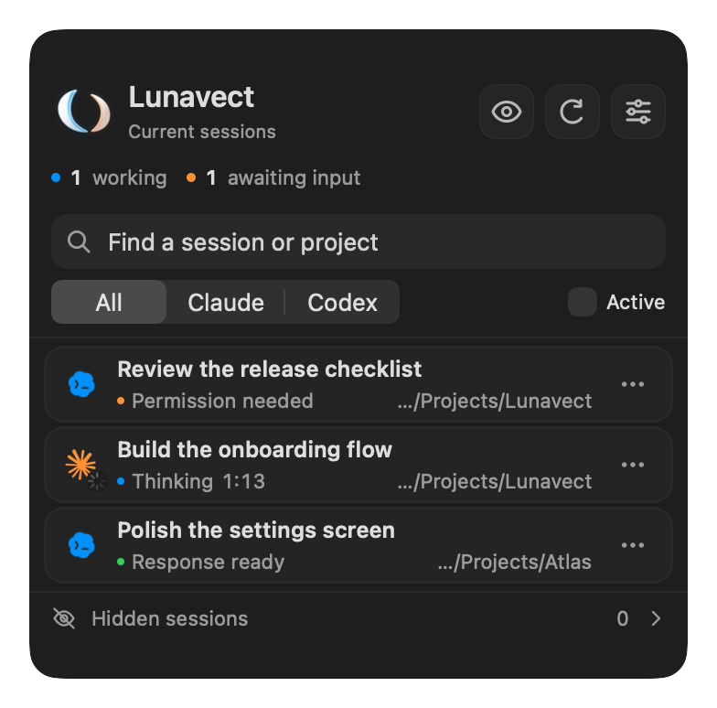

# Sessions

Click Lunavect in the macOS menu bar to open the session panel. It brings Claude Code and Codex tasks into one list, with a title, project and the latest available state. Settings open separately from the panel.

 

## Reading a session

| State | Meaning |
| --- | --- |
| Working / Thinking / tool name | A source currently reports work. The timer belongs to the current response, not the session's total lifetime. |
| In background + task count | Claude finished a reply while its own background tasks (shell commands, subagents, monitors) are still running. Claude Code wakes the session when they finish, so the task counts as working. |
| Thinking or a tool + task count | Claude is still working and has already started background tasks. |
| Compacting context | Claude's compaction lifecycle reports work. Manual compaction has its own timer; automatic compaction retains the running response's start. |
| Permission needed | The client is waiting for approval. Return to the client to respond. |
| Input needed | The client is waiting for input, including an MCP form, a request to open a link in the browser or a background agent that asks for input. An answered form returns the session to working. |
| Response ready | A response finished; the session may still be open in its client. |
| Idle | A session is open without confirmed current work. |
| Error reason | Claude's turn ended with an API error: limit reached, can't reach Claude, service error, sign in again, account issue or error. See [Notifications](notifications.md#errors). |
| No network | The Mac has had no network connection for at least 10 seconds while the task was working. The timer keeps running; the previous status returns with the connection. |
| Unknown or stale | Lunavect does not have a sufficiently current state. This is not treated as working or finished. |

The working and awaiting-input counters summarize current states. A saved title, recent file read or an old catalog entry does not turn a task into a live session. The decorative menu-bar phrases describe an animation state, not a tool the agent has actually called.

A retained Claude background `blocked` entry without a live process ID, live status or fresh lifecycle event stays outside Current sessions and the awaiting-input count. Lunavect preserves its waiting phase and data; this is a product boundary for current presence, not a claim that Claude completed the task. A live wait remains current regardless of the session's start date, and background `working` remains current even without a process because autonomous work can continue between process lifetimes.

## Closing questions from Claude

From 0.1.2, a recognized closing decision question such as “Shall I apply these changes?” is shown as **Input needed** and included in the waiting count. The adapter examines the documented local [`Stop.last_assistant_message` field](https://code.claude.com/docs/en/hooks#stop-input); it does not read another transcript or save the response text.

This is a conservative inference from selected Russian, English and German wording, rather than confirmation of a permission dialog. Unknown wording remains **Response ready**. A fresh idle poll preserves the question without extending its timestamp; resumed work, explicit later states or the existing ten-minute hook freshness limit supersede it. During the running app session, once a later runtime state supersedes a question, an idle or missing catalog row cannot revive that same saved question. A later closing question is still counted. Structured permission events retain priority.

## Permission requests

**Permission needed** starts when Claude Code or Codex reports a permission request (`PermissionRequest`), or when Claude reminds you of a prompt that has waited about six seconds. Neither client reports a request you decline, so the wait ends with the session's next step: the approved tool reports its result; after **No** with a comment the task continues with another tool or replies; a new prompt, an error, an interruption or the end of the session also end it.

Declining without a comment, or pressing **Esc**, stops Claude's turn and reports nothing about the request. A CLI session in Claude's session list then shows **Stopped** at the next list read. Otherwise the row changes to **Idle** when Claude reports that its input prompt has been idle for about a minute (`idle_prompt`; an open dialog reports `permission_prompt` instead), or with your next prompt. A subagent's request stays until that subagent continues or ends.

A Claude subagent's request ends only with that subagent's next tool or its end (`SubagentStop`), not with work of the main conversation or of other subagents. Codex tool events do not name a subagent, so any later Codex tool call ends a Codex request. The result of a call that started before the request does not end it. A read-only call that Claude starts in parallel while a dialog is open can end the wait early; Claude's six-second reminder shows it again. Claude's session list does not say what a session waits for, so while a request is fresh, a list that reports the session as waiting keeps **Permission needed**.

## Background tasks in Claude

Claude Code reports its in-flight background work in the documented [`Stop.background_tasks` field](https://code.claude.com/docs/en/hooks#stop-input). When a reply ends while such tasks are still running, Lunavect keeps the session working with the status **In background** instead of **Response ready**. A small blue capsule shows the number of Claude's background tasks whenever the session works: it grows when Claude starts a background command, subagent, monitor or workflow (`PostToolUse`, including a command Claude or **Ctrl+B** moves to the background, reported by its background task id) and is set exactly from `background_tasks` at the end of each reply (`Stop`). When a subagent finishes (`SubagentStop`), its `background_tasks` list can only lower or confirm the count of each kind, never raise it: the list does not show whose tasks it describes, the session's or the subagent's own. An empty list therefore leaves the count to the next `Stop`. A raise that is refused is kept as a diagnostic entry with counts only. Only tasks reported as `running` or `pending` with an identifier are counted. A background command that finishes while Claude is still working is counted until the next of those events. The row tooltip lists commands, agents and monitors. A finished task wakes Claude again; replies to those task events stay silent. **Response ready** and its notification arrive once, when Claude stops with nothing left to wait for. Only counts by kind are stored, never commands or descriptions.

Long-lived services never finish and never wake the session, so they do not hold the response: shell tasks that run dev servers (`npm run dev`, `vite`, `next dev`, `http.server`, `uvicorn`, `jekyll serve` and similar), followers (`tail -f`, `log stream`, `--watch`), tunnels and `docker compose up` without `-d` are recognized by their command. A background pause stays current for up to an hour without new events, which covers long renders and builds; an idle poll from Claude's session list does not end it. Another endless task that is not recognized keeps the session working until that hour passes and its state becomes unknown; no completion notice is sent for it. A closing question still shows **Input needed**. Scheduled wakeups (`session_crons`) do not hold the response. Clients that do not report `background_tasks` keep the previous behavior.

## Context compaction

The development build observes Claude's documented `PreCompact` and `PostCompact` hooks, with `SessionStart` from compaction as a completion fallback. An idle catalog poll cannot cancel a fresh compaction event. Manual completion returns to idle; automatic completion returns to the running response. Later prompt, tool, stop and permission events supersede compaction normally. Missing completion events expire under the existing ten-minute hook freshness limit. Instructions and compacted summaries are not stored. Adding the handlers does not recover an already-missed start event or prove delivery from an existing client session.

## Find and arrange sessions

Use search to find a title or project. **All**, **Claude** and **Codex** select providers; **Active** narrows the list to active states. Clicking the awaiting-input count shows only sessions that need a reply or permission; click it again to show all. The row menu contains the available actions for that session, including pinning, hiding, opening a project and copying a resume command. Drag rows to change their order.

On a trackpad, swipe a row right to open it or left to hide it. From the keyboard, **Command-F** focuses search and **Down Arrow** moves from search to the first row. On a focused row, **Return** opens it, **Up Arrow** and **Down Arrow** move focus, **Option-Up Arrow** and **Option-Down Arrow** move the row, **Command-Delete** hides it and **Esc** clears the row focus. After hiding a row, **Undo** in the panel footer or **Command-Z** while the panel is open restores it.

Open **Hidden sessions** to review and restore hidden rows. Hiding affects Lunavect's list only: it does not cancel work or delete a conversation. A hidden session that is still working can continue to contribute to activity totals. A hidden session stays hidden while a source still lists it; once a complete client catalog has not listed it for 35 days, it leaves the hidden list. Reopening the panel from the menu bar returns to current sessions; search and filters are kept, while a message shown at the top of the panel is cleared when the panel closes.

Optional automatic hiding is configured in Settings. It applies to inactive sessions after the selected interval; it does not hide working, waiting or unknown states just because an event is old. The interval starts only for a row the panel shows as current, so a session that ended before Lunavect showed it does not enter the hidden list. Retained Claude background history (finished, stopped, failed or dormant `blocked` tasks that `claude agents --json --all` keeps listing without a live process) is never hidden automatically, and its re-listing does not keep an explicitly hidden entry alive: that entry expires after 35 days like a session no longer listed. A background task Lunavect saw working still announces its completion. When macOS corrects the clock (a time-server step or a manual change), running intervals start again rather than counting the jump as inactivity. A new installation leaves automatic hiding off.

## Return to a task

Click a row or use its open action. Lunavect uses the originating client when it can identify one. A live session in Terminal or iTerm2 is brought to the front in its own tab, restoring a minimized window. The tab is found by the terminal device recorded by the session's hooks or the live Claude catalog PID. Detached hooks follow their client’s parent processes to recover the device. If only a project folder is known, it must identify one unambiguous terminal device; multiple sessions in the same folder are not interchangeable. Paths are resolved before this fallback comparison. A terminal app that is not running is not launched, and Desktop or editor sessions are never matched to a CLI in the same folder.

Before any scripting, Lunavect checks with process metadata (owner, controlling device and executable path) that the session's provider still runs on the recorded device. macOS gives a closed tab's device to the next new tab while the session's last hook still looks recent; such a tab is not selected, and the message suggests resuming the session with the copied command. An npm-installed CLI runs as `node` and cannot be told apart from other scripts, so a device running an interpreter keeps the earlier behavior: Terminal tabs without running processes are skipped. The Claude process recorded by the session's hooks counts wherever it runs, whatever its file name, and a process of yours whose executable path macOS does not return (for example a CLI binary that an update removed while the session runs) is never taken as proof that the session ended. When the terminal's `login` process hides the host from process inspection, Lunavect follows its parent to name the real terminal application.

macOS asks once for permission to control Terminal or iTerm2. Lunavect requests it before the tab search and waits up to a minute for your answer; only the search itself has the 10-second limit. If the terminal app is hidden from process inspection and both apps run, they share those 10 seconds. A denied Automation permission, an unanswered permission prompt, a timeout and a missing tab have distinct recovery messages; a denied request directs you to System Settings → Privacy & Security → Automation.

A Claude run in print mode (`claude -p` or `--print`), as plugins and scripts start it, has no window or tab. It is listed as **Background run** with the app that started it, is not counted as working, sends no notifications and is not activity; clicking it explains that there is nothing to open. Only the presence of the flag is read from the process arguments.

Other terminal hosts are recognized and reported by name instead of searching Terminal tabs: Ghostty, Warp, kitty, WezTerm, Alacritty and other emulators, and panes of tmux, screen or an ssh session. Cursor and other editors built on VS Code use the editor route with the VS Code companion, like VS Code. Switching to them is not supported yet; return to the window manually or use the row's project or resume action. A CLI with a controlling terminal but no `TERM_PROGRAM` (for example over ssh) counts as a terminal session and never opens Codex Desktop.

A live session whose tab cannot be focused is reported as possibly open, even when its CLI is missing or being replaced by an update: nothing is launched for it. A finished terminal session needs the CLI and project folder to remain available; its resume command is opened through Terminal. Other clients depend on the navigation route that client supports.

Opening an application is not always the same as returning to the exact conversation. If the client is missing, the project was moved or the route is unsupported, use the row's project or resume action when available. Include the client and its version in reports about navigation problems.

## Limit usage and continue later

Two-finger click (or ⋯) on a Claude or Codex session offers **Limit Usage…** and **Continue Later…**; the **Tasks** tab lists every limited, resting and planned session.

- **Limit Usage…** stops the session when the week reaches the level you set. The suggested level spreads the rest of the week evenly over the days to its reset. Between readings the week's level is estimated from the tokens the session logs write, in the provider's own percent per price-weighted token, and corrected by each new reading.
- **Don't get cut off by the 5-hour window** (on by default) asks the agent to finish its step at 88 % of the five-hour window and holds new actions at 96 % until that window resets.
- Near a limit the agent's next action carries a request to finish its step and write two lines, what is done and what is left. At the limit its next action is refused with the reason; the process, its files and the conversation stay as they are. Your own message to the session is never blocked: it lifts the stop (the week's limit, or the rest until the 5-hour window resets), and Lunavect types nothing more. Claude Code's own continuation after its usage limit comes as a prompt too, with a fixed text and no marker; Lunavect recognises that text, or a prompt within two minutes after Claude Code reported its wait ending, and does not take it as yours: a week's stop holds it back, a rest lets it go. The **Tasks** card shows the agent's last reply.
- Enforcement uses the `PreToolUse` and `UserPromptSubmit` hooks Lunavect installs, so it needs the hooks connected; Codex runs them only after you trust them (Settings → Connections warns otherwise). A stop lapses five minutes after its window resets, also when Lunavect is not running then; only Lunavect continues the session.
- The continuation (**Continue from where you stopped** or your own words) is typed into the session's own Terminal or iTerm2 tab once the agent is idle and not asking for a permission, and only while that session's agent still runs on the tab's device: macOS gives a closed tab's device to the next tab. Codex 0.159 and later run their hooks in a background service without a terminal, so a Codex session's tab is found by its folder when exactly one Codex runs there, and the text goes there only when the tab's title (Codex writes "<thread name> | <folder>") names the session. At a shell prompt in that tab Lunavect runs `claude --resume` or `codex resume` from the session's folder; when the session's own recorded tab is closed or runs something else, it opens a new window of the same terminal app. When the tab cannot be told, the session is not listed (hidden, or not read yet after launch), or a usage limit cut a Claude session off (Claude Code may be showing its limit options, which Enter would answer), nothing is typed and no second process starts: the card says what to do. Unsent text you left in the session's input box is sent together with the continuation. For desktop apps and editors a notification says what to write.
- When a usage limit cuts a session off mid-answer, **General → If a limit cuts work off** decides: ask whether to continue after the reset (default), continue without asking, or do nothing. Claude Code 2.1.234 and later waits in the session and continues by itself; Lunavect then only presses Enter when the Mac slept through the reset and Claude Code waits for it, or offers to continue when Claude's own automatic continue is off or gave up.

Typing into a tab uses the Automation permission (see [return to a task](#return-to-a-task)). Notices about stopped sessions and the cut-off question are described in [notifications](notifications.md).

## How state is determined

Lunavect combines local lifecycle hooks, available client runtime information and session metadata. Claude Desktop metadata can supply a title for an existing Claude Code session. Codex can use a local log-based fallback when shared runtime information is unavailable. Compatibility with other local status-bar records is optional and does not modify their event handlers. When Lunavect's own hook reports a session, such a record is ignored for it: the hook sees the same events with exact times and background work.

Titles and project metadata are kept separate from activity evidence. Re-reading an event does not change its timestamp. Old events eventually lose authority, and late events from a completed turn should not restart its working indicator. A Claude lifecycle-only launch stays out of both current and hidden sessions until a prompt, tool, response or request establishes actual task activity. Resuming or forking an existing conversation (`claude --resume`, reported as `SessionStart` with source `resume` or `fork`) opens a task you chose, so it appears as **Idle** before its first prompt; only a fresh start or `/clear` waits for work. A hidden session that you resume or fork is shown again at once. If the process that ran the session's last turn has exited (for example the window was closed or the process killed mid-reply) and a new process reports the session, that old turn ended with its process: the resumed session starts as **Idle** without the old turn's timer, instead of appearing to work again. This prevents temporary CLI launches used by another agent from appearing as empty user tasks; existing conversations remain untouched.

Claude hooks also record which process ran them (its PID only). If Claude's complete session list no longer contains a session and that process has exited, a turn that was still working or waiting is shown as **Stopped** at once, instead of counting as work or waiting for up to ten minutes (an hour for a background pause). This covers a closed terminal window, `kill` or a crash, which send no `SessionEnd`. The rule applies to sessions in a terminal, VS Code or a JetBrains IDE, whose Claude process lives for the whole session. Claude Desktop, background and unidentified clients (for example Agent SDK scripts) may end their process between turns, so for them the ordinary freshness limits apply until this is verified. Once a session is shown as **Stopped**, a later failed or partial list does not show it as working again; a new event of that session or a complete list that names it again does. Before that decision, a failed or partial list, a process ID that macOS has already reused and records from an earlier helper keep the ordinary freshness limits.

In the development build, each background event tick also re-evaluates the published session freshness before waiting for a source read. Menu-bar waiting and running counts therefore expire even if a read is blocked or fails repeatedly. This does not renew evidence, delete tasks or start duplicate reads. Fresh source observations can confirm the status again.

Client catalogs are read every 15 seconds while the panel is open or a session works, otherwise every 45 seconds. A catalog observation counts from the moment its request started, so a hook event written while a slow read runs stays the newer evidence. It stays current for two minutes, two idle reads plus margin: one failed or late read does not empty the list, while a source that stays unavailable still expires its rows. If Claude's JSON listing changes shape so that no row can be read, **Settings → Connections** reports an unsupported response instead of showing an empty list.

The panel updates timers while visible. Closing it stops its display timer, while background collection can continue. Freshness depends on the source; long work, sleep/wake and changes in client formats can affect what Lunavect can confirm.

In the development build, restarting Lunavect also recovers a running response's exact start when it lies before the most recent 8 MB of a Codex log. Recovery searches older lifecycle metadata in bounded chunks and matches the current turn ID. It keeps the original event time, preserves a known start across large appends, and never borrows the start of another response. Very large logs can require several background polls before the timer returns.

## Codex catalog discovery in the development build

Internal Codex subagents (spawned children, review and compaction workers) are not independent user sessions. The development build recognizes explicit `source.subAgent` or `parentThreadId` metadata from the app-server protocol and the matching persisted local source for hook-only observations. These records stay out of session rows, running/waiting counts, notifications and hidden-session history. Ordinary Desktop/CLI tasks and separately created peer chats remain visible. Parent tasks keep their own observed status; worker activity does not invent parent progress. A temporary catalog gap cannot reintroduce an already identified child.

Codex's general task list can omit Desktop tasks with empty preview metadata even when their individual summaries are available. Lunavect requests all supported source kinds and supplements the list with identifiers from recent, strictly validated local rollout filenames. It then reads each summary through `thread/read` with `includeTurns: false`; filename recency only prioritizes discovery and never establishes a working state. This adapter does not modify the Codex database, repair metadata or resume tasks.

Discovery is bounded: directory enumeration has an entry/time budget, and at most 32 additional summaries share a three-second budget per refresh. Known active tasks have a separate priority-read budget before list pagination. Failed confirmation preserves their identity while downgrading their runtime evidence; fresh lifecycle events or an exact writable-log match must establish current work again. Optional discovery is best effort, so an older task outside the candidate window or a changed filename format may remain unavailable. This is not a claim that every task in every Codex version is discoverable.

Previously discovered unknown or response-ready rows do not receive this retention guarantee and may disappear from the list when the optional supplement cannot confirm them on a later refresh.

## Codex log freshness in the development build

The local fallback recognizes the exact originators `Codex Desktop` and `codex_work_desktop`; the ambiguous `vscode` source alone does not establish a Desktop client.

An event normally becomes stale after 120 seconds without fresh evidence. For an unfinished response, the development build can use macOS `libproc` to check whether Codex still has that exact log open for writing. The file is matched by device and inode. An open app, a changed file timestamp or another process merely reading the file is insufficient.

For a selected CLI that starts through a script, a successful local app-server request can establish the native executable behind that launcher. This in-memory association expires when either executable changes. Interpreter wrappers must have one unambiguous child chain; an inaccessible or ambiguous chain cannot establish activity. The exact writable-log requirement still applies.

Checks are batched as events approach the freshness limit. A result lasts ten seconds and stays separate from the event timestamp and response start time. Completion and cancellation take priority; inaccessible process information falls back to the ordinary freshness rule. Process arguments, environment and memory are not read. This can preserve a long-running response without new log entries, but cannot distinguish thinking from a stuck process or permission waiting without a separate event.

## Lunavect's own quota probe

To read Claude's weekly and five-hour usage when no statusLine value is fresh, Lunavect runs Claude Code's `/usage` in its private folder `~/Library/Application Support/Weekleft/QuotaProbe`. Claude Code lists that run in `claude agents --json` like any interactive session. Lunavect removes it where the catalog is read: a row whose folder is the probe folder or inside it (after resolving symbolic links, `/private` and trailing slashes), or whose process is a direct child of Lunavect, never becomes a row, a menu-bar count, a notification, an activity or Keep Awake observation, a reason for faster polling or a hidden-session entry. Hook and status-bar records from that folder are ignored as well. The name Claude generates for the run is not used. Only a folder path that names the probe folder is resolved on disk; other session folders are compared as text, so a project on a disconnected network volume cannot stall the session list.

A `/usage` check started by hand with the probe's exact command (`claude --safe-mode … --tools "" … /usage`) is recognized by its arguments (read from the argument block of your own Claude process; the environment the kernel returns with them is discarded unparsed). It stays in the list as **Service limit check** instead of **Input needed**, is not counted in the menu bar, sends no notifications and adds no activity or Keep Awake observation. Clicking it explains that it is a limit check and how to close it. A `claude` session in which you type `/usage` yourself is an ordinary session.

When a row cannot be opened, the message names where the session runs: the terminal built into Claude or Codex, an unsupported terminal or another app, and what to do instead.

## Tool-launched Claude runtimes

A Claude CLI started through a command inside a Claude or Codex task can appear in the Claude catalog as an interactive session even though it has no separate Desktop conversation. Lunavect checks bounded native process ancestry: a Claude runtime, an intervening command process and another agent runtime establish an internal launch. These records stay out of rows, counters, notifications, activity observations and hidden-session history. The check reads executable paths and parent PIDs, and for a `node` or `bun` process its argument block, to recognize Claude Code installed with npm by the script path; the kernel returns that process's environment after the arguments in the same block, and it is discarded unparsed. Conversation content is never read.

Direct runtime/supervisor chains are ambiguous. Explicitly declared Claude background tasks remain independent and override ancestry inferred by a hook. Missing or truncated ancestry does not invent an origin or erase a previously established internal launch. A later confirmed independent launch can restore the same Claude session. Unknown executable wrappers may remain unclassified; this is not comprehensive detection of every possible launcher.

## Codex memory consolidation

Codex consolidates its memories with an internal agent that works in `CODEX_HOME/memories` (by default `~/.codex/memories`). Its lifecycle events look like a task, but it has no rollout, no thread in the Codex catalog and no title, so the app-server cannot read it back. Lunavect treats Codex sessions in that folder as internal agents: they stay out of rows, counters, notifications, activity and the read-back of known active sessions, and they cannot mark the catalog as incomplete. A task you start yourself inside that folder is treated the same way; a folder with the same name elsewhere is not.

## If the list looks wrong

1. Clear search and filters, then check **Hidden sessions**.
2. Open **Settings → Connections** and inspect the affected provider.
3. Check handler approval if requested, then run a new task in the official client.
4. If the problem remains, [report it](https://github.com/lovach/Lunavect/issues/new?template=bug.yml) with the expected and actual state and steps to reproduce.

Do not attach private conversations or unredacted session records. Full lifecycle and exact-session navigation coverage across clients remains incomplete; see [verification](verification.md).

[Connections](connections.md) · [Activity](activity.md) · [Privacy](privacy.md)

Codex rollout filenames may include a segment UUID after the thread UUID. Discovery uses the primary thread identity, and the activity reader accepts that form only with a matching bounded `session_meta` header. The extra filename identifier is not a new user task or evidence of a subagent; explicit source metadata still determines internal-agent filtering.

## Sessions in editors

Lunavect 0.2.3 includes local companions for VS Code and JetBrains 2026.2. Install the companion from Settings → Connections → Sessions in editors to select the existing Claude or Codex terminal tab. The same section says when an installed companion is older than the bundled one, or installed but not answering. See [IDE session setup and compatibility](ide-sessions.md), including the separate limits for provider panels and remote workspaces.
